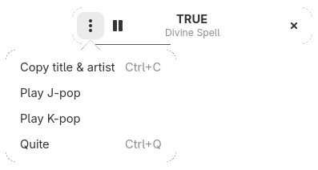

[](https://github.com/noobping/listenmoe-app/actions/workflows/win.yml)
[](https://github.com/noobping/listenmoe-app/actions/workflows/linux.yml)

# The world's cutest radio

The world's cutest radio. Dive into pure kawaii energy with nonstop Japanese and Korean hits, streamed straight from [LISTEN.moe](https://listen.moe/).



## Flatpak App

Install the app from my Flatpak Repo:

```sh
flatpak remote-add --if-not-exists flatpaks https://noobping.github.io/flatpaks/flatpaks.flatpakrepo ;\
flatpak install flatpaks dev.noobping.listenmoe
```

## Stand-alone Executable

You can download a stand-alone binary from the [GitHub Releases](https://github.com/noobping/listenmoe-app/releases/latest) page. After downloading:

1. Mark it as executable:

```sh
chmod +x ./listenmoe.linux.x86_64 
```

2. Run the executable.

While the app is running, press `F2` to install or uninstall it locally. The app will place (or remove) its files in the user data directory: `~/.local`.

## AppImage

This application is an internet radio client. It streams music from the internet, so it needs network access.
If you run this app inside **firejail**, make sure the firejail profile allows network access. Otherwise it won’t be able to stream any audio.
To install the provided firejail profile:

```sh
mkdir -p ~/.config/firejail
cp /path/to/extracted/usr/share/firejail/listenmoe.profile ~/.config/firejail/
firejail listenmoe
```
